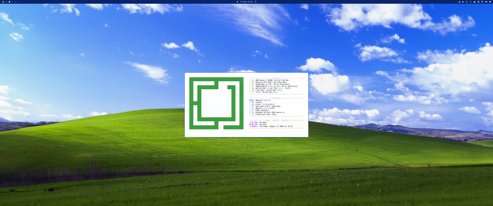
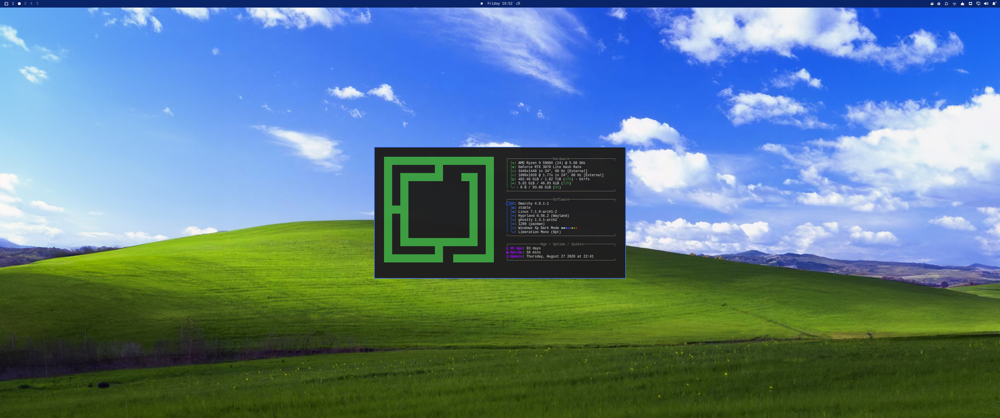

# Windows XP theme for Omarchy

A Windows XP (Luna) theme for [Omarchy](https://omarchy.org/), with a light
mode and a dark mode, plus a matching pixel-perfect XP cursor set.

|                              Light                              |                             Dark                              |
| :---------------------------------------------------------------: | :---------------------------------------------------------------: |
|  |  |

## What's included

- **`themes/windows-xp`** — light theme (Luna blue accents, navy taskbar, classic XP palette).
- **`themes/windows-xp-dark-mode`** — dark variant of the same theme (same wallpaper, same font, same cursor; surfaces and text flipped for dark mode, GTK icon theme switched to `Yaru-blue-dark`).
- **`cursors/ModernXP`** — a pixel-perfect Windows XP Xcursor theme, built from a patched fork of [na0miluv/modernXP-cursor-theme](https://github.com/na0miluv/modernXP-cursor-theme) (see [Cursor credit](#cursor-credit) below).
- **`cursors/ModernXP-src`** — the patched fork's full source (GPL-3.0 "Corresponding Source" for the prebuilt cursor above) — `src/`, `build.sh`, `install.sh`, `LICENSE`.
- **`hooks/theme-set.d/set-cursor-for-theme.sh`** — an Omarchy `theme-set` hook that switches the cursor to ModernXP whenever either `windows-xp` theme is applied, and reverts to the system default cursor for any other theme.
- **`install.sh`** — copies everything into place.

## Install

Requires [Omarchy](https://omarchy.org/).

```bash
git clone https://github.com/raccoon-overlord-dev/omarchy-xp-theme.git
cd omarchy-xp-theme
./install.sh
```

This copies the two theme directories into `~/.config/omarchy/themes/`, the
`ModernXP` cursor into `~/.local/share/icons/`, and installs the cursor-switch
hook via `omarchy hook install theme-set`.

Then apply either variant:

```bash
omarchy theme set windows-xp             # light
omarchy theme set windows-xp-dark-mode   # dark
```

(Omarchy titlecases the folder name for display, so these show up in
`omarchy theme list` as "Windows Xp" and "Windows Xp Dark Mode".)

## Manual install

If you'd rather not run the script:

```bash
cp -r themes/windows-xp themes/windows-xp-dark-mode ~/.config/omarchy/themes/
cp -r cursors/ModernXP ~/.local/share/icons/
omarchy hook install theme-set hooks/theme-set.d/set-cursor-for-theme.sh
omarchy theme set windows-xp
```

## Uninstall

```bash
rm -rf ~/.config/omarchy/themes/windows-xp ~/.config/omarchy/themes/windows-xp-dark-mode
rm -rf ~/.local/share/icons/ModernXP
rm ~/.config/omarchy/hooks/theme-set.d/set-cursor-for-theme.sh
omarchy theme set <some-other-theme>
```

## Cursor credit

The `ModernXP` cursor set in `cursors/ModernXP` is built from a **fork** of
[na0miluv/modernXP-cursor-theme](https://github.com/na0miluv/modernXP-cursor-theme)
("A pixel-perfect remastering of the original Windows XP cursors, with a
modern touch"), licensed GPL-3.0. All credit for the cursor artwork goes to
the original author; this repo only patches the build.

The upstream `build.sh` had a few broken cursor-config references (wrong
source-size directories for `all-scroll`, `col-resize`, `openhand`, `zoom`,
and a stray space in `right-arrow`) that made those five cursors fail to
build; this fork (in `cursors/ModernXP-src`, dated 2026-08-28) patches those
so the full set builds cleanly with `xcursorgen` + Inkscape. `cursors/ModernXP`
ships the prebuilt result so you don't need those build tools just to install
the theme — `cursors/ModernXP-src` ships alongside it as the corresponding
source GPL-3.0 requires when you convey the built binaries.

To rebuild the cursor yourself:

```bash
cd cursors/ModernXP-src
./build.sh    # needs xorg-xcursorgen + inkscape
```

## License

This repository is licensed under the **GNU GPL v3.0** (see `LICENSE`),
matching the bundled `cursors/ModernXP` / `cursors/ModernXP-src`, which are
a derivative of na0miluv/modernXP-cursor-theme (also GPL-3.0). The theme
configuration (`themes/`, `hooks/`, `install.sh`) is original to this repo
and released under the same license for simplicity — feel free to lift the
`.toml`/`.sh` files into your own differently-licensed project, they're
trivial config with no meaningful copyright claim.
